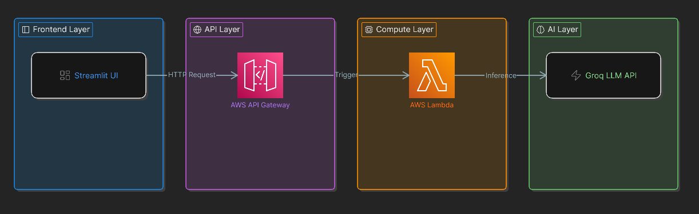
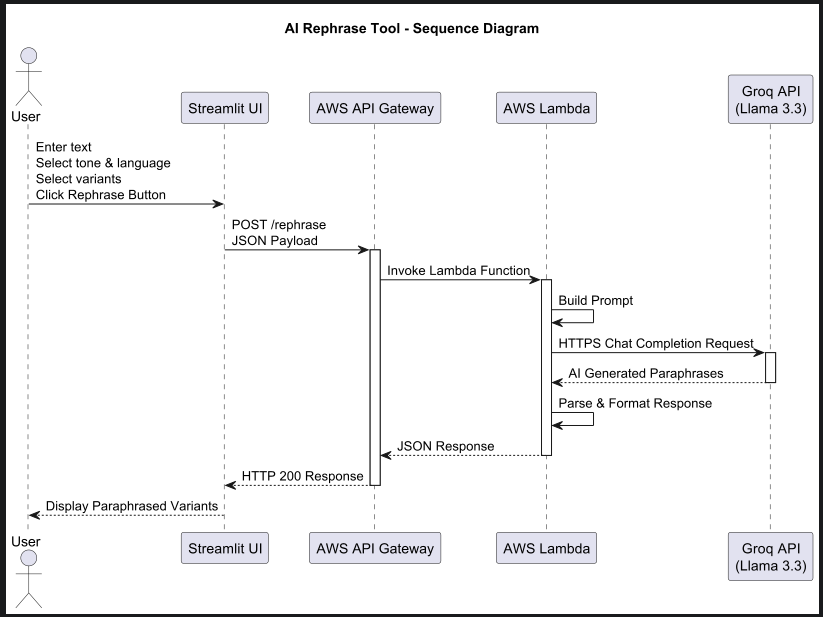
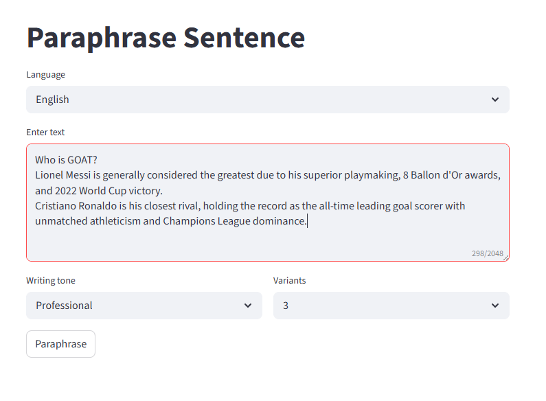
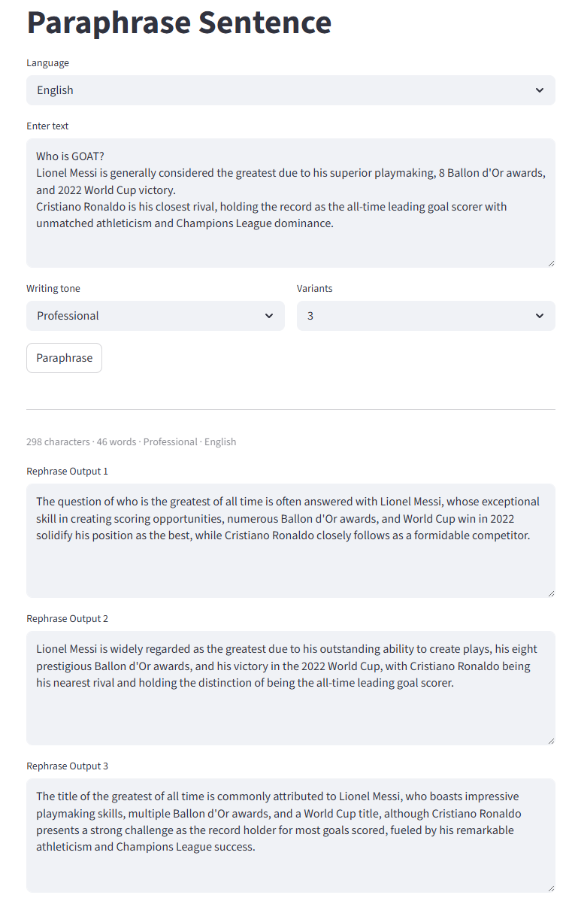

# Rephrase Tool powered by AI

An AI-powered paraphrasing application built using:

- Streamlit - for UI
- AWS Lambda - as a service layer and processor
- AWS API Gateway - mediator and security
- Groq LLM API - Underlying AI Model used - llama-3.3-70b-versatile

---

# Architecture

## Complete Architecture



## Request & Response Flow
1. User enters text in Streamlit UI
2. Streamlit sends POST request
3. API Gateway receives request
4. API Gateway invokes Lambda
5. Lambda builds AI prompt
6. Lambda calls Groq API
7. Groq returns paraphrases
8. Lambda formats JSON response
9. API Gateway returns response
10. Streamlit displays results

## Sequence diagram



---

# Features

- Multiple paraphrase variants
- Writing paraphrase tone selection
- Multi-language support
- AWS serverless backend
- Groq LLM integration
- Responsive UI

---

# Tech Stack

| Layer | Technology |
|---|---|
| Frontend | Streamlit |
| API | AWS API Gateway |
| Backend | AWS Lambda |
| AI Model | Groq Llama 3.3 |
| Hosting | AWS |

---

# Project Structure

```bash
project/
│
└── service/
    └── rephrase_lambda.py
└── web/
    └── rephrase_app.py
└── images/
    └── ui_input.png
    └── ui_output.png
├── requirements.txt
├── README.md

```

---

# API Request Example

```json
{
  "language": "English",
  "tone": "Formal",
  "variants": 3,
  "text": "Who is GOAT - Ronalodo or Messi"
}
```

---

# API Response Example

```json
{
  "results": [
    "The debate about who is the greatest of all time, Ronaldo or Messi, continues to spark intense discussion among football fans.",
    "The question of whether Cristiano Ronaldo or Lionel Messi deserves the title of the greatest player of all time remains a topic of ongoing debate.",
    "Football enthusiasts often argue over who should be considered the greatest player, with Ronaldo and Messi being the two most commonly cited candidates."
  ]
}
```

---

# Installation

## Clone Repository

```bash
git clone https://github.com/your-repo/rephrase-tool.git
```

---

## Install Dependencies

```bash
pip install -r requirements.txt
```

---

## Run Streamlit

```bash
streamlit run rephrase_app.py
```

---

# AWS Deployment

## Services Used

- AWS Lambda
- API Gateway
- CloudWatch

---

# Environment Variables

| Variable | Description |
|---|---|
| GROQ_API_KEY | Groq API Key |

---

# Screenshots

## Home Screen



## Generated Responses



---

# Future Improvements

- Streaming responses
- User authentication
- Prompt templates
- Download paraphrases
- Usage analytics

---

# Author
- Santosh Darvandar - Software Engineer
